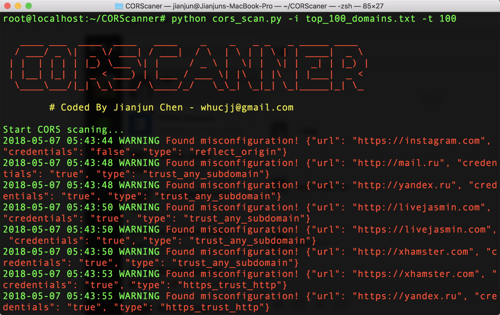

## About CORScaner 

CORScaner is a python tool designed to discover CORS misconfigurations vulnerabilities of websites. It helps website administrators and penetration testers to checking misconfigured CORS policies for the domain they are targeting. 

The correct configuration of CORS policy is critical to website security, but CORS configurations have many error-prone corner cases.  Web developers who are not aware of these corner cases are likely to make mistakes. Thus, we summarize several common types of CORS misconfigurations and integrate them into this tool,  to help developers/security-practioners quickly locate and detect such security issues.

## Screenshots



## Installation

- Download this tool
```
git clone https://github.com/chenjj/CORScaner.git
```

- Install dependencies
```
sudo pip install -r requirements.txt
```

CORScaner depends on the `requests`, `gevent`, `tld` and `argparse` python modules.

## Recommended Python Version:

* The recommended version for Python 2 is **2.7.x**

## Usage

Short Form    | Long Form     | Description
------------- | ------------- |-------------
-u            | --url         | URL/domain to check it's CORS policy
-i            | --input       | URL/domain list file to check their CORS policy
-t            | --threads     | Number of threads to use for CORS scan
-o            | --output      | Save the results to text file
-v            | --verbose     | Enable the verbose mode and display results in realtime
-h            | --help        | show the help message and exit

### Examples

* To check CORS misconfigurations of specific domain:

``python cors_scan.py -u example.com``

* To check CORS misconfigurations of specific URL:

``python cors_scan.py -u http://example.com/restapi``

* To check CORS misconfigurations of multiple domains/URLs:

``python cors_scan.py -i top_100_domains.txt -t 100``

* To list all the basic options and switches use -h switch:

```python cors_scan.py -h```

## Misconfiguration types

Misconfiguration type    | Description
------------------------ | --------------------------
Reflect_any_origin       | Blindly reflect the Origin header value in `Access-Control-Allow-Origin headers` in responses
Prefix_match             | `wwww.example.com` trusts `example.com.evil.com`
Suffix_match             | `wwww.example.com` trusts `evilexample.com`
Not_escape_dot           | `wwww.example.com` trusts `wwwaexample.com`
Substring match          | `wwww.example.com` trusts `example.co`

## License

CORScaner is licensed under the MIT license. take a look at the [LICENSE](./LICENSE) for more information.


## Credits
This work is inspired by the following wonderful researches:

* James Kettle, “Exploiting CORS misconfigurations for Bitcoins and bounties”, AppSecUSA 2016*
* Evan Johnson, “Misconfigured CORS and why web appsec is not getting easier”,  AppSecUSA 2016*
* Von Jens Müller, "CORS misconfigurations on a large scale", [CORStest](https://github.com/RUB-NDS/CORStest)*

## Version
**Current version is 1.0**
